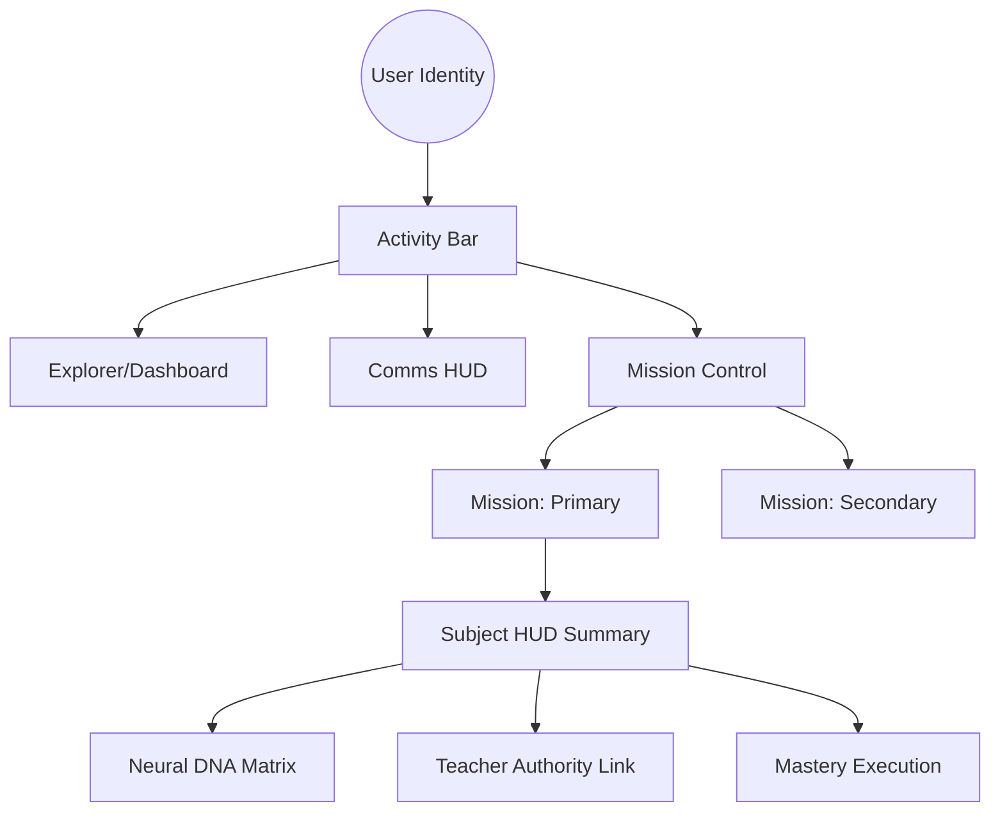

# Master Technical Disclosure: E-OS HUD System Architecture Analysis

## 1. Executive Summary
The **E-OS HUD (Integrated Digital Learning Platform Management System)** is a mission-centric management platform built on a "VS Code HUD" aesthetic. It leverages a multi-identity role model, a strict "Iron Rule" typography system, and a decentralized-sharding data strategy designed to scale to 10 million users.

## 2. Interface Layer (The "Iron Rules")
The UI is governed by a set of immutable rules to ensure high-fidelity "HUD" aesthetics:

- **Typography Lockdown**: 
    - Font: **Sarabun** (Weight 200/300 baseline).
    - Thai Rule: Minimum **16px** (`text-base`) for any block containing Thai text.
    - `letter-spacing: 0 !important` globally.
- **Visual Depth**: 
    - Baseline: **Zinc-850** (Transparent glassmorphism over deep backgrounds).
    - Accents: Neon-Cyan (`#22d3ee`) for Primary Missions.
- **Unity Cards**: High-level core missions represented by interactive grid cards with real-time mastery metrics.

## 3. Interaction Engine (Management & Unity)
The system uses a **Unity Mission Architecture** to categorize user objectives:

## 4. Communication Matrix
Role-based communication is strictly hierarchical:
- **Vertical Comms**: Subordinates can always message their direct superiors.
- **Contextual Discovery**: Users discover contacts based on their organizational unit (e.g., Student sees Teacher, Teacher sees Principal).
- **Synchronization**: The system maintains a `FIFO` notification buffer to prevent UI stutter during high-traffic updates.

## 5. Data & Scaling Strategy (10M User Goal)
To handle 10 million students, E-OS employs a **Sharded Node Management** strategy:
- **Client-Side Data (`data.js`)**: Acts as a "Hot Cache" for current session entities.
- **Sharding**: Data is partitioned by **ESA (Educational Service Area)** and **School ID**.
- **Smart Ceiling**: Local memory is capped using a FIFO eviction policy for non-essential entity metadata.

## 6. Functional Breakthrough: Subject HUD
The newly implemented **Subject HUD** serves as the intelligence hub for learning. It visualizes the **Neural DNA** of a subject (Knowledge, Practice, Affective, Focus) and provides a direct, low-latency link to the subject authority (Teacher), bridging the gap between data and human interaction.

---
**Technical Auditor: Antigravity**  
*Status: Architecture Verified • Iron Rules Enforced • Unity Ready*
