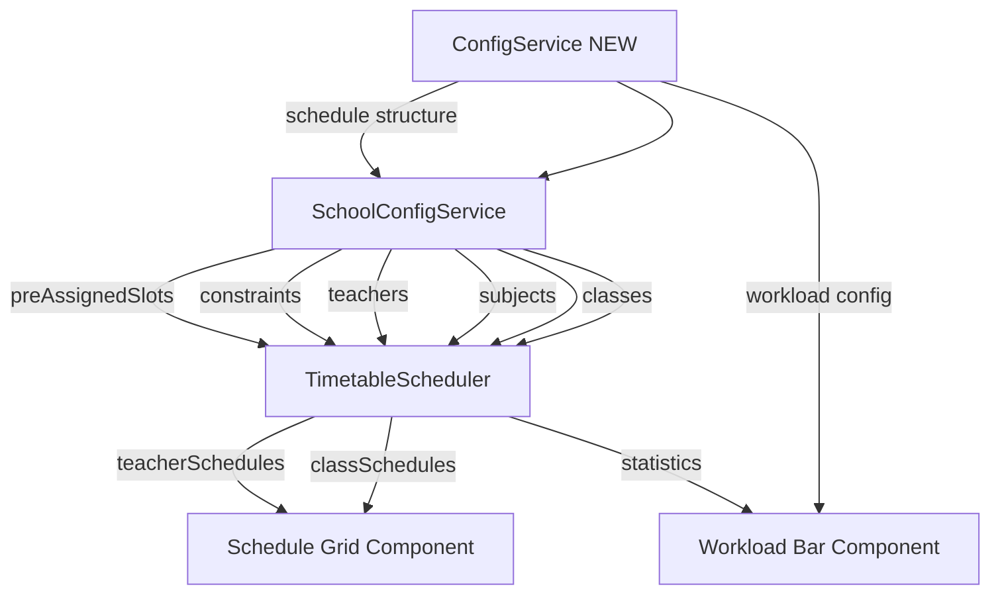

# E-OS Design Spec: Teacher Workload & Smart Config System

> **Status**: Approved Design — Ready for Implementation
> **Date**: 2026-02-12
> **Authors**: User (Director/Architect) + AI Assistant
> **Applies to**: All roles, all schedule-related features

---

## 1. Teacher Workload — 4 Domains (กคศ. ว9/2564)

### 1.1 Legal Framework

สำนักงาน กคศ. กำหนดภาระงานขั้นต่ำ ตาม ว9/2564 และ ว21/2564:

| เกณฑ์ | ค่า | ประเภท |
|-------|-----|--------|
| ภาระงานรวมขั้นต่ำ | ≥ 20 ชม./สัปดาห์ | 🔒 Hard Rule |
| ชั่วโมงสอนตามตารางสอน | ≥ 12 ชม./สัปดาห์ | 🔒 Hard Rule |
| งานอื่นๆ (ด้าน 2-4) | ≥ 8 ชม./สัปดาห์ | ส่วนเหลือ |
| PLC | ≥ 50 ชม./ปี (≈1 ชม./สัปดาห์) | 🔒 Hard Rule (ต่อปี) |

### 1.2 Four Domains of Teacher Workload

```
ภาระงานรวม (≥ 20 ชม./สัปดาห์)
│
├── ด้าน 1: ชั่วโมงสอนตามตารางสอน (≥ 12 ชม.)
│   └── คาบสอนในตาราง, กิจกรรมพัฒนาผู้เรียน, ลูกเสือ, ชุมนุม
│
├── ด้าน 2: งานส่งเสริมและสนับสนุนการจัดการเรียนรู้
│   └── PLC, แผนการสอน, วัดผลประเมินผล, สร้างสื่อ, ครูที่ปรึกษา/โฮมรูม
│
├── ด้าน 3: งานพัฒนาคุณภาพการศึกษาของสถานศึกษา
│   └── หัวหน้ากลุ่มสาระ, หัวหน้าสายชั้น, หัวหน้าฝ่าย (งบ/บุคคล/วิชาการ), ประกัน QA
│
└── ด้าน 4: งานตอบสนองนโยบายและจุดเน้น
    └── โครงการพิเศษ, กิจกรรมนโยบายรัฐบาล, กิจกรรม ศธ., สวดมนต์
```

### 1.3 Key Rules

- **ด้าน 1 (ชม.สอน) ≥ 12 ชม. — ลดไม่ได้** แม้มีภาระงานพิเศษมาก
- ภาระพิเศษ (หัวหน้าฝ่าย ฯลฯ) นับในด้าน 2-4 **ไม่ใช่หักลบจากด้าน 1**
- ครูปฐมวัย: ชม.สอน ≥ 5 ชม. (กฎพิเศษ)
- ผอ.: ชม.บริหาร ≥ 5 ชม., รอง ผอ.: ≥ 10 ชม.

### 1.4 Alert System

| สถานการณ์ | ระดับ | สี |
|-----------|-------|-----|
| ด้าน 1 < 12 ชม. | 🔴 CRITICAL | แดง — ต่ำกว่า กคศ. |
| ภาระรวม < 20 ชม. | 🟡 WARNING | เหลือง — ภาระงานไม่ถึงเกณฑ์ |
| ภาระรวม ≥ 20 ชม. & ด้าน 1 ≥ 12 ชม. | 🟢 OK | เขียว — ผ่านเกณฑ์ |

---

## 2. Smart Default + Manual Override Pattern

### 2.1 Core Principle

> **ทุกค่าที่ configurable = มี Default ที่ใช้ได้เลย + ผอ. toggle เป็น Manual ได้**

ตอบโจทย์:
- โรงเรียนที่ **ยังไม่พร้อม** → กดใช้ Default ได้เลย
- โรงเรียนที่ **มีความเฉพาะ** → ผอ. override ได้ทุกจุด

### 2.2 Three Modes

| Mode | ป้ายกำกับ | ผอ. เปลี่ยนได้? | ที่มาค่า |
|------|----------|-----------------|---------|
| `locked` | 🔒 กคศ. / สพฐ. | ❌ | เกณฑ์กฎหมาย |
| `auto` | ⚙️ Auto | ✅ → manual | ค่า default ของระบบ |
| `manual` | ✏️ Manual | ✅ | ค่าที่ ผอ. กำหนดเอง |

### 2.3 Universal Config Schema

ทุก configurable item ใช้ shape เดียวกัน:

```javascript
{
  key: "plc_hours_per_week",        // unique identifier
  label: "ชั่วโมง PLC",              // display name (TH)
  domain: 2,                        // ด้าน 1-4 (null if not workload)
  default: 1,                       // smart default value
  value: 1,                         // actual value in use
  mode: "auto",                     // "auto" | "manual" | "locked"
  lockedBy: null,                   // null | "กคศ." | "สพฐ." | "ศธ."
  min: 0,                           // minimum allowed
  max: 5,                           // maximum allowed
  unit: "ชม./สัปดาห์",               // display unit
  scope: "teacher",                 // "teacher" | "school" | "system"
  appliesToRoles: ["TEACHER"]       // which roles this config affects
}
```

### 2.4 Config Items Catalog

#### Workload (ภาระงาน)

| Key | Label | Default | Mode | Locked By |
|-----|-------|---------|------|-----------|
| `teaching_min_hours` | ชม.สอนขั้นต่ำ | 12 | locked | กคศ. |
| `total_workload_min` | ภาระงานรวมขั้นต่ำ | 20 | locked | กคศ. |
| `plc_hours_per_week` | ชม. PLC | 1 | auto | — |
| `homeroom_hours` | ชม.ครูประจำชั้น | 1 | auto | — |
| `dept_head_hours` | ชม.หัวหน้าฝ่าย | 3 | auto | — |
| `grade_head_hours` | ชม.หัวหน้าสายชั้น | 2 | auto | — |
| `subject_head_hours` | ชม.หัวหน้ากลุ่มสาระ | 2 | auto | — |
| `max_periods_per_week` | คาบสูงสุด/สัปดาห์ | 35 | auto | — |
| `max_periods_per_day` | คาบสูงสุด/วัน | 7 | auto | — |

#### Schedule Structure (โครงสร้างตาราง)

| Key | Label | Default | Mode | Locked By |
|-----|-------|---------|------|-----------|
| `days_per_week` | จำนวนวัน/สัปดาห์ | 5 | locked | สพฐ. |
| `periods_per_day` | จำนวนคาบ/วัน | 8 | auto | — |
| `lunch_period` | คาบพักเที่ยง | 5 | auto | — |

#### Pre-assigned Slots (กิจกรรมกำหนดตายตัว)

| Key | Label | Default | Mode |
|-----|-------|---------|------|
| `pray_slot` | สวดมนต์ | ศุกร์ คาบ 8 | auto |
| `scout_slot` | ลูกเสือ/เนตรนารี | พุธ คาบ 8 | auto |

#### Subjects (วิชา)

| Key | Label | Default | Mode | Locked By |
|-----|-------|---------|------|-----------|
| `core_subjects` | 8 กลุ่มสาระ | ตามหลักสูตร 2551 | locked | สพฐ. |
| `extra_subjects` | วิชาเสริม | ตาม data.js | auto | — |
| `activity_subjects` | กิจกรรมพัฒนาผู้เรียน | ตาม data.js | auto | — |
| `periods_per_subject` | จำนวนคาบ/วิชา/ระดับ | ตามหลักสูตร | auto | — |

---

## 3. Unity Across Roles — "Same Skeleton, Different Lens"

### 3.1 Principle

> ทุกโรลเห็น **โครงสร้างเดียวกัน** ผ่าน **เลนส์ต่างกัน**
> Share component — ไม่ใช่ clone page

### 3.2 Shared Components (ใช้เหมือนกันทุกโรล)

| Component | ใช้ร่วม | จุดที่ต่าง |
|-----------|---------|-----------|
| Schedule Grid | CSS Grid, card system, color tokens | Data source (ตัวเอง vs ทุกคน) |
| Workload Bar | 4-domain bar, alerts | Scope (ตัวเอง vs ห้อง vs โรงเรียน) |
| DNA Heatmap | Heatmap structure, color scale | Data granularity |
| Config Panel | Smart Default UI, toggle pattern | Visibility (ผอ. เห็น config, ครูไม่เห็น) |
| Card System | `vs-neon`, `--sj-*-rgb` tokens | Content ในการ์ด |

### 3.3 Role Lens Matrix

| Component | นักเรียน | ครู | ผอ. | ผอ.เขต |
|-----------|---------|-----|-----|--------|
| Schedule Grid | ตารางเรียนตัวเอง | ตารางสอนตัวเอง | ตารางทุกคน + AI | Aggregate ทุก ร.ร. |
| Workload Bar | ชม.เรียน | ภาระงาน 4 ด้าน | ภาระงานรวมทุกครู | ภาระงานรวมทุก ร.ร. |
| Config Panel | ❌ ไม่เห็น | ❌ ไม่เห็น | ✅ toggle auto/manual | ✅ view only |

### 3.4 Role Accent Color

ใช้ CSS variable `--role-accent` เป็น accent ทั่ว UI:
- ทำให้ user รู้ทันทีว่ากำลังอยู่ในมุมมองของโรลไหน
- Component ไม่ต้องเขียนใหม่ — แค่เปลี่ยน variable

---

## 4. Data Requirements for Auto-Schedule

### 4.1 What the Director Must Provide

| ข้อมูล | สถานะปัจจุบัน | ใครบรรจุ |
|--------|-------------|---------|
| ห้องเรียน (Classes) | ✅ Hardcoded `data.js` | ผอ. ควรจัดการผ่าน UI |
| วิชา (Subjects) | ✅ Hardcoded `data.js` (locked core + auto extra) | ผอ. ปรับ extra ได้ |
| บุคลากร (Teachers) | ✅ Hardcoded `data.js` | ผอ. ควรจัดการผ่าน UI |
| นักเรียน (Students) | ❌ ไม่มี roster | Engine ไม่ต้องการ (จัดตามห้อง) |
| ภาระงานพิเศษ (Workload) | ❌ ไม่มี | ผอ. กำหนดผ่าน config |
| Pre-assigned Slots | ✅ Hardcoded | ผอ. ปรับได้ (auto → manual) |

### 4.2 Engine Input Dependencies



---

## 5. Implementation Priority

| Priority | Feature | Effort |
|----------|---------|--------|
| P0 | Workload Bar component (4 domains) | Medium |
| P0 | Config schema + storage | Medium |
| P1 | Director config UI (Smart Default toggle) | Large |
| P1 | Alert system (กคศ. violations) | Small |
| P2 | Director data management (classes, teachers) | Large |
| P3 | Student roster management | Medium |

---

## References

- ว9/2564 — หลักเกณฑ์ประเมินตำแหน่งและวิทยฐานะ ตำแหน่งครู
- ว21/2564 — ภาระงานของข้าราชการครู
- ว23/2564 — ประเมินผลการปฏิบัติงาน
- หลักสูตรแกนกลาง 2551 ปรับปรุง 2560
